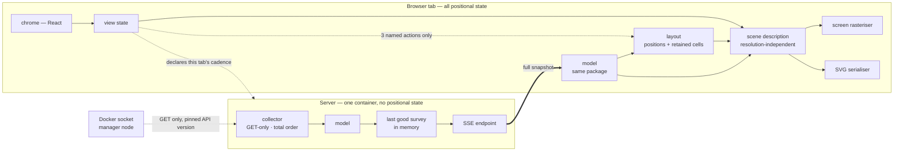
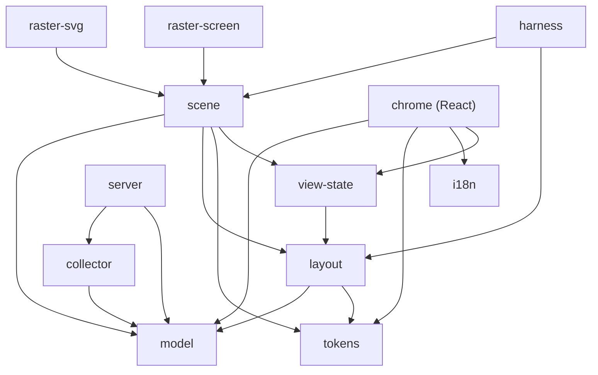
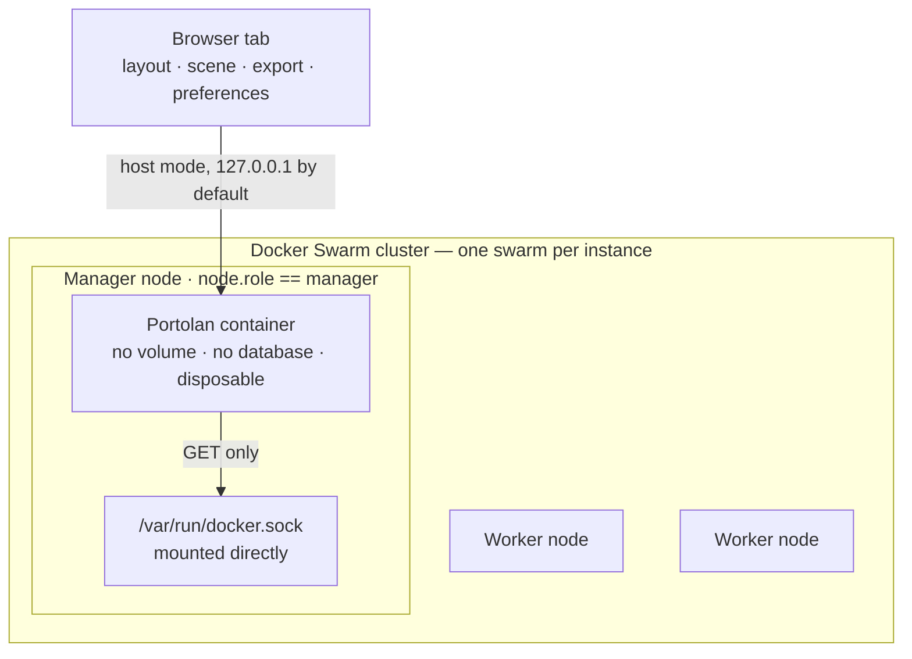
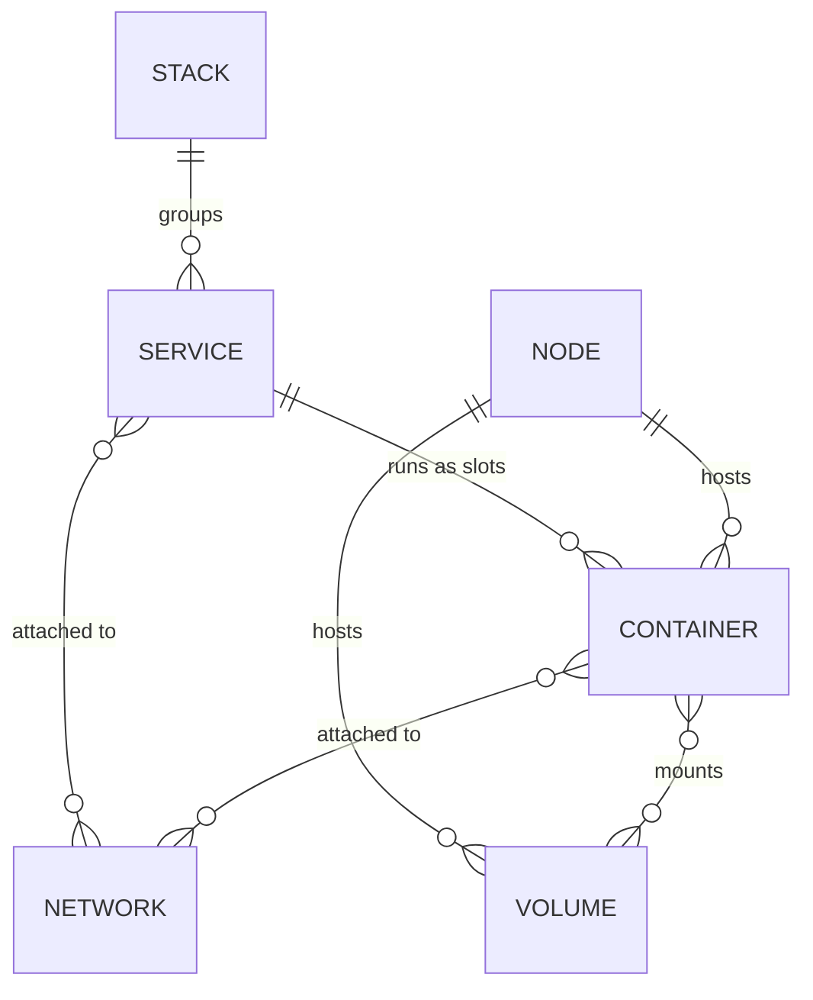

# Architecture Spine — Portolan

## Design Paradigm

**A unidirectional pipeline with an adapter at each end.** Docker socket → collector → model → layout → scene → rasterisers. FR-2 makes the absence of a return path real rather than stylistic: there is no command side anywhere, so no stage ever writes back toward its source.

FR-2 bounds what has no return path: **no command reaches the cluster**, from anywhere. It does not make the product write-free in general — the tab declares its own survey cadence to the server (AD-12), and that single upward call is the only one in the system.

State has exactly **four owners**, each with one writer, and every other stage is a pure function of its input:

| State | Owner | Written by |
| --- | --- | --- |
| Last good survey | server, in memory (AD-13) | the poll loop |
| Positions and retained cells | `layout` (AD-2, AD-37) | the three FR-16 actions only (AD-3) |
| Selection, filters, search, camera, display controls | `view-state` (AD-3, AD-39) | chrome, and picking (AD-36) |
| Breathing phase, tweens, lifecycle timers, veil age | screen rasteriser, frame-local (AD-2) | the frame loop |

The network seam falls between model and layout: the server ends at the model, and everything positional lives in the browser tab.



## Invariants & Rules

### AD-1 — The server does not hold positions

- **Binds:** FR-16, NFR-2, NFR-1
- **Prevents:** a build that puts layout state on the server, creating a shared map the product never asked for — two people would be forced into one view.
- **Rule:** Layout runs in the browser tab and its output lives in that tab's memory. No position, camera, zoom or framing value is ever sent to, stored by, or returned from the server.

### AD-2 — Four state owners, each with one writer

- **Binds:** all — and specifically FR-16, FR-40, FR-45, FR-53, FR-61, FR-71
- **Prevents:** survey state scattered across several stages, so that *why did the map move when it shouldn't have* has no single place to look — **and** the opposite failure, a spine so strict that FR-71's breathing, FR-53's layered first draw, FR-40's visible relayout movement and FR-54's ageing veil have nowhere legal to live and get smuggled into layout.
- **Rule:** State lives in the four owners the Design Paradigm table names, and nowhere else. **Survey-derived state** — positions, retained cells, the identity of what was present last survey — is `layout`'s alone. **Presentation state** — per-object breathing phase, the relayout tween holding both position sets, enter and exit lifecycle timers, cold-load sequencing, the veil's wall-clock repaint — is frame-local, lives in the screen rasteriser, is derived from the scene plus a clock, and **never flows back** into scene, layout or model. **View state** is `view-state`'s (AD-3), and it includes FR-56's frozen panel: a subject that vanished between surveys leaves a snapshot of its values in view state, dismissed by the next click and never by itself. The **last good survey** is the server's (AD-13). Collector, model, scene and the SVG serialiser hold nothing across calls.
- **Consequence worth naming:** this is *why* FR-71 can promise translation 0px with click targets that never travel. Breathing is a local deformation applied by the rasteriser over fixed positions — not a position that moves. The guarantee is structural, not a discipline someone has to maintain.

### AD-3 — View state and layout state are two stores, with one direction of writing

- **Binds:** FR-16, FR-38, FR-79, FR-33, FR-34
- **Prevents:** a filter, a selection, a search, or opening the detail panel moving anything on the map.
- **Rule:** View state may **invoke** layout but never **writes** layout's state: positions are layout's output and no other stage may set them. **Within one view**, only the three actions FR-16 names — *Reorganise*, a change of zone mode, and toggling the node backdrop — may call layout. Every other interaction reads layout output and never invokes it. Switching view or subject is not an exception to this rule: it draws a different surface entirely (AD-33).
- **Enforcement:** layout counts its invocations, and a test asserts that filtering, selecting, searching, hovering, opening the panel, changing text size, changing density, toggling masking and changing palette each produce **zero** calls. AD-8's determinism test cannot catch an unwarranted call — it returns the same answer — so without this counter, AD-3's entire reason to exist is guarded by nothing.

### AD-4 — The model is one shared TypeScript package, imported by both ends

- **Binds:** NFR-5, NFR-6, FR-6, FR-80
- **Prevents:** collector and renderer drifting into two incompatible notions of what a service or a network is, which is exactly what NFR-5's three seams exist to stop.
- **Rule:** One package defines the graph types; collector and renderer both import it and neither redefines a type. The renderer may know a Docker-ism in exactly the three places NFR-6 names — object vocabulary (FR-80), the socket-unreachable screen (FR-57), the engine-too-old message (FR-64) — and nowhere else.

### AD-5 — Object identity is the slot, not the Docker container ID

- **Binds:** FR-13, FR-16, FR-71
- **Prevents:** a `docker stack deploy` reshuffling both positions and silhouettes across a whole stack — putting into the product the very defect of the founding scenario, *a drawing obsolete at the next stack deploy*.
- **Rule:** Every identity key is **qualified by object kind**, always — `volume:web` and `network:web` are two objects, and an unqualified key would make them one, with one silhouette (AD-6) and one cell (AD-37). Within a kind: replicated service → `stack/service/slot`; global service → `stack/service/node`; volume and network → name; node and service → Docker ID. A Swarm task is immutable and a service update destroys and recreates its tasks, but the slot number survives — the key is built on what survives.

### AD-6 — Silhouettes are seeded from the identity key

- **Binds:** FR-13
- **Prevents:** the shape channel resetting at the exact moment the user opens the map to understand what moved. Seeded from the container ID as FR-13 literally reads, *the same shape across every survey* is false from the first redeployment onward.
- **Rule:** The deterministic shape seed is the AD-5 identity key. **Declared departure from FR-13 — raised upstream.** Accepted cost, named: two genuinely different containers (before and after a redeployment, possibly a different image, possibly a different node) render as one body. The map asserts a continuity Docker does not know. The container ID stays visible in the detail panel (FR-25), where it misleads nobody.

### AD-7 — The collector imposes a total order before the model

- **Binds:** FR-1, FR-13, FR-16
- **Prevents:** positions reshuffling between two surveys of an **unchanged** cluster. The Docker API guarantees no ordering on its `list` calls; without this rule a collector that returns what Docker gave it and a layout that iterates in input order are each perfectly compliant and the product is broken. The determinism test does not catch it — it replays one fixture in one order.
- **Rule:** The collector sorts every collection by its AD-5 identity key before handing it to the model. No downstream stage may depend on Docker's response order.

### AD-8 — Layout is a pure, deterministic function of a signature that includes the previous positions

- **Binds:** FR-13, FR-16, FR-41, FR-42, FR-70, success criterion #1
- **Prevents:** a reload producing a fourth, undeclared relayout in violation of FR-16, and a screenshot nobody can reproduce. And — the defect this spine carried until reconciliation — a signature with **no input for previous positions**, under which FR-16's *a new container appears near its neighbours, a vanished one fades in place* is not merely unimplemented but inexpressible.
- **Rule:** `(model, previousPositions, seed, mode) → positions`, where `mode` carries every restored relayout parameter (zone mode **and** node backdrop, per FR-16's two of three), with fixed iteration counts, a fixed seed, a stable iteration order (AD-7), and the deformed hull reserved **before** placement (FR-13). Banned inside the layout stage: `Math.random`, any clock read, any sort without a total-order comparator, any dependence on frame timing, **and every transcendental** — `Math.sin`, `cos`, `tan`, `exp`, `log`, `pow`, `atan2` and their kin. Layout arithmetic is restricted to `+ - * /` and `Math.sqrt`, which IEEE 754 specifies exactly and every conforming engine must round identically. The transcendentals are *implementation-approximated* by ECMAScript, deliberately so, and V8's bundled fdlibm — which once made them incidentally portable — is being unwound. This matters more than cross-architecture: layout runs in Chromium, Firefox **and** Safari (NFR-16), which AD-32 does not test, and only exactly-specified arithmetic makes determinism hold there without a test proving it.
- Layout places in the abstract space of AD-40; canvas pixels never enter it. On a cold start `previousPositions` is empty, which is what makes the first frame reproducible.
- **Density:** layout reserves hulls at the **maximum** density setting, always. Density then only shrinks rendered bodies inside space already reserved, so it is a scene parameter and never a relayout — otherwise FR-42's density control becomes a fourth relayout action that FR-16 forbids, or bodies overlap in violation of FR-13. Accepted cost, and it is one §6 already carries: fewer objects fit than circle packing would allow.
- **Enforced by two different tests, because these are two different properties** — see AD-37.

### AD-9 — One scene description, several rasterisers

- **Binds:** FR-46, FR-47, FR-48, NFR-8, NFR-9, §7.1
- **Prevents:** screen and export diverging (the shader the SVG cannot reproduce), and an irreversible Canvas2D-versus-WebGL bet taken before any measurement exists.
- **Rule:** The renderer emits a resolution-independent scene — zones as fields, bodies as path data, marks anchored in screen space, text carrying its floor, pick geometry (AD-36), and the chart furniture of AD-35. A screen backend paints it; an SVG serialiser writes it. Neither rasteriser may hold information the other cannot obtain from the scene.
- **PNG (FR-46) is the screen backend rendering the export scene to an offscreen surface, then encoding it** — not a third rasteriser, and not a screenshot of the live canvas. It must be, because AD-34 makes the export a *different scene* from the screen (masking differs by default) and FR-48 puts the chart furniture inside it. `toDataURL()` on the on-screen canvas satisfies neither.
- The silhouette hull is **one exported function**, per AD-38: `layout` calls it to reserve, the scene calls it to draw. Layout reserves at the worst case FR-70 permits (+32% of base radius in any direction), so the rendered hull always fits inside the reserved one and *bubbles never fuse and never overlap* holds without the reservation needing to know the final stretch.
- **Compositing is resolved in the scene, not left to the rasteriser.** Where zone fields overlap, the scene carries the **resolved** composited colour, not a stack of translucent layers for a rasteriser to alpha-blend. Without this, no stage knows what the worst composited field actually looks like, and AD-28's 3:1-over-worst-composited-field gate — the one the whole edge guarantee rests on — is not computable at all. This is also what makes the deferred luminance clamp (NFR-9) a value the scene applies rather than a rendering accident.

### AD-10 — The framework never crosses onto the map surface

- **Binds:** NFR-8, NFR-19, FR-79
- **Prevents:** 396 bodies rendered through a reactive component system, putting every hover, every selection and every breathing frame through the reconciler. This rule is more load-bearing under React than it would have been under a compiled framework, and that is the price of AD-25.
- **Rule:** No graph object — body, zone, edge, mark, stack outline — is a React component, a reconciled list element, or a node in a React tree. The map is one surface mounted once and painted from the scene. React owns the chrome exclusively: toolbar (FR-76), detail panel (FR-25, FR-79), legend band (FR-78), filters, search (FR-36), display controls, and the FR-57 and FR-60 screens.
- **The seam is two-way, and its upward half is narrow by construction.** Downward: React writes view state, the rasteriser reads it. Upward: the map surface emits pick events (AD-36) carrying **identity keys only** — never geometry, never a scene object, never a DOM node. Anything chrome needs about the chart's shape — the extents *Fit to chart* frames to, the orphan count, the set search lights, the legend's contents — is **derived in the scene package** and handed to chrome as data (AD-35), never recomputed by chrome and never read off the map surface.

### AD-11 — Transport is SSE carrying a full snapshot, never deltas

- **Binds:** FR-3, FR-54, FR-55
- **Prevents:** a delta reconciliation protocol paid for with no measured gain at 400 objects, and a poll-versus-push split between two builds.
- **Rule:** Each survey is pushed whole over SSE with its own timestamp. Staleness derives from that timestamp plus SSE disconnection — never from the configured interval (FR-5).

### AD-12 — Survey cadence and render cadence are decoupled

- **Binds:** FR-3, FR-5, NFR-3
- **Prevents:** the untaken decision behind a single poll loop serving tabs that each chose a different interval. Without this rule one build makes the interval a server property — the last tab to speak changes everyone else's map, violating *alters neither the population nor the rendering* — and another opens a poll loop per connection, multiplying load on the manager socket and letting tabs see divergent surveys.
- **Rule:** The server holds **one** poll loop, running at the minimum interval among connected clients. Each tab displays a new snapshot only at **its own** selected cadence, always taking the freshest snapshot it holds at that moment. The timestamp a tab shows is that of the snapshot it rendered, not of the last one it received.
- **FR-5 is satisfied by a threshold rule, not by the cadence:** the staleness veil (FR-54) trips on an **absolute** survey age strictly greater than the largest selectable interval plus a margin. Displaying every 60s necessarily means a snapshot up to 60s old — that part is arithmetic — but *choosing 60s must never by itself pale the chart*, and that is what the threshold guarantees.

### AD-13 — The server replays the last good survey; it never serves emptiness

- **Binds:** FR-54, FR-55, FR-4
- **Prevents:** a failed survey blanking a map that FR-54 promises will stay and merely pale. FR-54 is only implementable client-side if the server keeps feeding the last good state with its age.
- **Rule:** The server retains the last successful survey in memory and replays it immediately to a newly connected tab. When a survey fails, it keeps serving that snapshot with its true age. A failed survey is a product state, never an absence of data.

### AD-14 — Three exhaustive branches on tab open

- **Binds:** FR-53, FR-57
- **Prevents:** dead product at first contact. FR-57 is the only screen in Portolan allowed to teach, and it carries the configuration line that fixes the socket mount; putting it behind a timer makes it useless at the exact moment it is needed.
- **Rule:** A good survey exists → replay it at once. No good survey and the last attempt failed → FR-57 immediately, with no timer. No good survey and no attempt has completed → the FR-53 layered cold load.

### AD-15 — The Docker adapter is read-only by construction

- **Binds:** FR-2, NFR-3
- **Prevents:** read-only remaining an intention that only holds while nobody adds a call. This turns *we wrote no writes* into *we cannot write one*.
- **Rule:** The underlying HTTP client refuses any method other than `GET`. A non-GET request fails inside Portolan before it reaches the socket.
- **Every request carries an explicitly pinned API version in its path** (`/v1.NN/...`). An unversioned path makes the daemon serve whatever schema it currently has, so the shape of every payload drifts silently with the user's engine upgrade — and AD-27's recorded fixtures would hide exactly that, freezing a schema production does not guarantee. FR-64's check therefore guards **both** directions: the engine is too old to serve the pinned version, or the pinned version has been dropped by an engine too new.

### AD-16 — The Docker socket is mounted directly; no sidecar proxy `[ADOPTED]`

- **Binds:** NFR-1, NFR-3, FR-2
- **Prevents:** a first launch that demands a second moving part, and an amendment to NFR-1's *one container image*.
- **Rule:** Portolan mounts the manager socket directly. AD-15 makes read-only a property of the code rather than an intention, but NFR-3 is explicit that read-only at the product level is a promise and not a mechanism, and this spine does not claim otherwise: an in-process guard is not a capability boundary, and the socket remains root over the swarm. A whitelist proxy is documented in the README as **optional** hardening, never as a requirement.

### AD-17 — Default exposure is host mode on 127.0.0.1, constrained to a manager

- **Binds:** NFR-2, NFR-1
- **Prevents:** the v1 the brief warned against — an unauthenticated full-topology viewer with one-click export, reachable from any node.
- **Rule:** The published stack file binds host mode on `127.0.0.1` with `node.role == manager` placement. The three ways to open it up — routing mesh, internal overlay plus reverse proxy, VPN — are written as comments directly above the line to uncomment.
- **Accepted cost, named:** this default puts Portolan out of reach of the executive viewer, who by §1 opens it themselves and by success criterion #3 does so with the author not in the room. Someone has to open the binding first. NFR-2 leaves no alternative default — an unauthenticated full-topology viewer reachable from any node is the artefact the brief warned against — so the cost is paid here and AD-18's screen is what makes it survivable.

> **AD-18 is retired, and its id is never reused.** Proposed at the coaching checkpoint and ratified without being tested, it asked for a full-surface *not reachable* screen symmetric to FR-57. It is logically unimplementable: a server the browser cannot reach cannot serve the screen saying so. The need it named is real, and AD-45 answers it.

### AD-19 — The server writes nothing

- **Binds:** NFR-1, NFR-4
- **Prevents:** a volume or a database introduced to remember something, breaking *disposable container* and NFR-1's one `docker stack deploy`.
- **Rule:** No volume, no database, no disk cache, no writable path. Everything the server holds is in memory and dies with the container. Fonts and assets are baked read-only into the image (NFR-4).

### AD-20 — Display preferences live in browser storage

- **Binds:** FR-3, FR-43, FR-44, FR-51, FR-62, NFR-1
- **Prevents:** both failure modes — a server-side store introduced to remember preferences (breaking AD-19), and nothing remembered at all, forcing the executive viewer to reset palette and masking at every opening.
- **Rule:** Palette, light/dark, text size, **density (FR-42)**, **continuous motion (FR-61)**, screen masking (FR-51), zone mode, node backdrop and refresh interval persist in the browser, never on the server. FR-45's `prefers-reduced-motion` is an operating-system signal, not a preference: the resolved motion state is *motion runs only if the OS does not ask for reduced motion **and** FR-61's control is on*, so the OS can silence motion but the stored preference can never override it back on. Zone mode and node backdrop are two of FR-16's three relayout actions; restored at load they enter as **input parameters** to the pure layout, not as a fourth relayout. Accepted cost, named: the map you open is not necessarily the map your colleague opens — which AD-1 and AD-8 already allow, since divergence comes from action. Screen masking is persisted deliberately, against both UX spines, which predate FR-51's existence (the PRD lists it in §8.2 as an addition with no upstream): FR-51 exists so the map can be shown in a meeting, and a reload mid-meeting that puts the addressing plan back on the wall is precisely the harm it was written to prevent.

### AD-21 — Configuration is environment variables only

- **Binds:** NFR-1, FR-3
- **Prevents:** a display preference duplicated as an environment variable, creating two sources of truth for one setting.
- **Rule:** No configuration file, no command-line argument. Environment variables carry what belongs to the deployment — listen address, socket path, log level, default language (NFR-18). The browser carries what belongs to reading the map. The refresh interval is **not** an environment variable: FR-3 makes it a chrome control and AD-20 makes it a browser preference.

### AD-22 — The healthcheck tests that Portolan serves, not that the survey succeeds

- **Binds:** FR-54, NFR-1
- **Prevents:** Swarm restarting Portolan at every socket hiccup, making the map under the reader's eyes disappear. A failed survey is a product state (FR-54), not a sick container.
- **Rule:** The container healthcheck probes the HTTP surface only. Survey health is reported in the product, never to the orchestrator.

### AD-23 — Design tokens are one machine-readable artefact, and it is the source of truth

- **Binds:** NFR-11, NFR-12, NFR-13, NFR-14, FR-43, FR-44
- **Prevents:** `DESIGN.md` staying normative in prose while someone hand-copies values into CSS — the contrast tests then validate the copy instead of the design, and a transcription error becomes invisible and permanent.
- **Rule:** One file in the repository holds every namespace `DESIGN.md` declares, not colour alone — **colour, stroke, opacity, elevation, shape, density, spacing, layout, type, motion, rounded**, plus the numeric floors and the clamp rule. The renderer, the CSS, the layout stage and the tests all import that same file. No literal colour value, and no literal floor, exists anywhere else in the code.
- **One authored source, generated outputs.** The tokens are authored once as typed TypeScript — the form Node tests and the layout stage import directly — and a build step emits the CSS custom properties the chrome consumes. CSS is a generated artefact, checked by CI to be in sync and never hand-edited. Without a named format and a generation step this AD is a wish rather than a rule, because CSS, TypeScript and a Node test runner cannot otherwise read one file.
- **Scoping it to colour would orphan the load-bearing half**, and each orphan breaks a named invariant: `stroke` carries `edge.attach-min-length`, which is the stub length AD-29 ratchets; `opacity` carries AD-28's exemption values *and* is where the deferred luminance clamp (NFR-9) lands; `shape` carries the hull geometry without which AD-8's *deformed hull reserved before placement* is unimplementable; `layout` carries the canvas floor AD-29 measures against; `density` is AD-8's reservation maximum; `motion` is AD-2's presentation-state parameters. This is why `layout` imports `tokens` in the dependency graph — an edge a colour-only reading would have made look wrong.
- Accepted cost, named: `DESIGN.md` stops being normative on **values** and becomes the documentation of intent — the reasoning behind each token, the register, the measured figures. **Raised to the UX spine.**

### AD-24 — Strings are externalised from the first commit

- **Binds:** NFR-18, FR-80, FR-81
- **Prevents:** a retrofit that has to find every literal, on a product whose voice rules (FR-80, FR-81) make every string deliberate.
- **Rule:** One catalogue per language; no string literal in any component. A new language is a file, not a code change.

### AD-25 — React owns the chrome, and only the chrome

- **Binds:** NFR-19, NFR-4
- **Prevents:** the front-end half of NFR-19 staying open, with two builds picking two different chassis.
- **Rule:** The chrome is React 19.3. Its boundary is AD-10, which is not negotiable. Accepted cost, named and chosen: the heaviest runtime among the options weighed, in an air-gapped product that serves everything from its own image, for a chassis that uses none of React's reasons to exist — no routing, no server state, and no third-party component ecosystem, which NFR-4 forbids in practice.

### AD-26 — The scene is the assertion surface, never the pixels

- **Binds:** §7.1, NFR-10, NFR-11, NFR-13, FR-67, FR-68
- **Prevents:** a screenshot-comparison suite — fragile to GPU, font rasterisation and browser version — that gets disabled within a month, leaving the legibility floors unguarded on a product whose thesis is legibility.
- **Rule:** Contrast, type floors, stub length, body diameter and mark occupancy are asserted against the scene description, in Node, with no browser and no GPU. No visual-regression comparison is a correctness gate anywhere in the project.
- **Every geometric assertion names its motion phase.** A scene is generated with presentation state at a stated phase — by default motion off, breathing amplitude zero. FR-71's breathing swings body diameter by enough to move a ratcheted number on its own, so an assertion that does not fix the phase measures noise.
- **Named limit of this rule:** an assertion on the scene tests geometry and resolved colour, never glyph rasterisation. NFR-20's real question — whether `pgdata`, `pg-data`, `pg_data` and `pgdatal` are four visibly different strings at 9px in the shipped face — is not answerable here and is not answerable by AD-31 either. It is a design verification done by eye, once, and the architectural obligation is only that the face is pinned in the AD-23 token file and embedded in the image (NFR-4), so the thing verified is the thing that ships.

### AD-27 — Two kinds of fixtures, never mixed

- **Binds:** FR-1, FR-64, NFR-5, NFR-7
- **Prevents:** someone generating plausible Docker payloads, leaving the collector tested against our idea of the API rather than what Docker actually answers — precisely where FR-64 says engine behaviour varies by version.
- **Rule:** **Recorded** Docker API payloads, captured from a real cluster, are the only admissible input for collector and adapter tests. A **generated** synthetic cluster at NFR-7 scale (396 objects) is the only admissible input for scale, legibility and harness tests. A collector test never runs on synthetic data; a scale test never runs on a recording.

### AD-28 — NFR-11 and NFR-13 are blocking CI gates

- **Binds:** NFR-11, NFR-12, NFR-13
- **Prevents:** the legibility floors remaining promises in a document while the code drifts away from them silently.
- **Rule:** Contrast ratios (7:1 identifier channel, 4.5:1 chassis, 4:1 health, 3:1 both edge kinds over the worst composited zone field, 3:1 focus ring) and mutual separability of the six zone hues under simulated deuteranopia **in both palettes** are computed from the AD-23 token file and block merge. NFR-11's deliberate exemptions are declared **in the AD-23 token file**, each as a named pair of *what is exempt* and *the floor that still applies to it* — never hard-coded in the test. The PRD names three (the staleness veil FR-54, the reachability dim FR-33, the empty-filter pale FR-34) and that list is neither exactly right nor complete: the veil is not exempt at all but floored lower, at `DESIGN.md`'s 4.2:1, and reconciliation found further pairs that would turn a gate red on correct behaviour. A gate that fails on correct behaviour gets disabled, which would cost more than the gate is worth — so the exemption set is data the design owns, and completing it is a Deferred item with a named owner.
- **Two kinds of red, and only one is the failure this AD argues against.** Red because the palette is genuinely wrong — the light-palette tint collision NFR-13 already calls a defect — is the gate working, and starting there was chosen knowingly over two softer options. Red because a correct build trips an exemption the set does not name is the gate broken. Completing the exemption set before the gate is first enabled is what keeps the second from being mistaken for the first.

### AD-29 — The measurement harness is a ratchet, with no invented threshold

- **Binds:** §7.1, §7.2, NFR-7, NFR-9, NFR-10, NFR-11
- **Prevents:** both silent erosion of legibility commit by commit, and the invention of a threshold the PRD explicitly refuses to set.
- **Rule:** The harness is a v1 deliverable, not a convenience tool. It generates a synthetic cluster at NFR-7 scale, produces the scene on the **operative canvas** — the real width once FR-79 reserves the panel column, measured at NFR-16's 1440px viewport floor, which is ~884px and not the 1204px the PRD computed against. The number is read from the AD-23 token file's `layout` namespace, never written into the harness, so a chrome-column change moves the measurement with it — and reports the distribution of rendered body diameter, mark-rail occupancy as a fraction of the body, stub-length distribution, and contrast of both edge kinds over the worst composited field (computable because AD-9 resolves compositing in the scene). Every measure is taken at AD-26's stated motion phase. It runs on every pull request and blocks when a measure gets **worse** than `main`. It sets no absolute threshold; the reference updates on each merge to `main`.

### AD-30 — NFR-8 is not a CI gate, and the spine says so rather than pretending

- **Binds:** NFR-8, NFR-7
- **Prevents:** a latency gate on a shared runner that flickers, gets disabled, and leaves everyone believing NFR-8 is still guarded.
- **Rule:** 100ms at 396 objects on integrated graphics is measured by hand, on real hardware, with the harness. What CI guards in its place is scene generation time at 396 objects — CPU-bound, honest, and ratcheted like AD-29.

### AD-31 — Browser tests are smoke and chassis accessibility only

- **Binds:** FR-29, FR-57, FR-64, FR-76, FR-77
- **Prevents:** the slow, brittle end-to-end suite that is the classic failure mode of a graphical product — and duplication with AD-26, which already covers legibility and geometry without a browser.
- **Rule:** Closed scope: the server boots and serves, SSE establishes and delivers a snapshot, the map draws, chassis controls are tab-focusable in order (FR-29, FR-76, FR-77), FR-57 renders with no socket, FR-64 renders on an old engine. No user journey is automated; `EXPERIENCE.md`'s journeys are explicitly out of automated scope.
- **What closing that scope would have left unguarded, and where it is guarded instead:** AD-3's invariant (nothing moves under filter, selection, search or panel) is caught by AD-3's own invocation counter, not by a browser; FR-16 stability under churn is caught by AD-37; masking's footprint invariant (FR-49) is caught on the scene by AD-34, and its reach across chrome by AD-34's single-owner rule — FR-52's statement of what survives masking is chrome text (AD-24) and is not computed, so nothing tests it and nothing should. None of these needed a browser — but none of them was covered until reconciliation asked what a closed browser scope was silently dropping.

### AD-32 — CI runs both architectures; publication is tag-driven

- **Binds:** NFR-1, NFR-17, FR-13, FR-16
- **Prevents:** a push to `main` publishing an image nobody decided to release, and an arm64-only layout defect shipping untested.
- **Rule:** GitHub Actions. On pull request and on `main`: lint, typecheck, unit and scene tests, the AD-28 gates, the AD-29 and AD-30 ratchets, AD-31 smoke — and the AD-8 determinism test on **both** `ubuntu-24.04` and `ubuntu-24.04-arm`. `main` builds the image without publishing. A `v*` tag publishes the multi-arch `amd64` + `arm64` image to **GHCR** (no extra secret on a public repository) and **Docker Hub** (where the homelab tribe looks).

### AD-33 — Each view is its own surface, with its own layout

- **Binds:** FR-17, FR-18, FR-19, FR-20, FR-21, FR-59, FR-73, FR-16, FR-41
- **Prevents:** the three views having no architectural existence at all — under which a tab switch has no legal route to layout, because AD-3 forbids every caller FR-16 does not name. FR-16 itself carves the exception out: *entering a different view or a different subject is a new surface being drawn, not a relayout of this one.* Without this AD the product's navigation is unbuildable by a builder obeying the spine literally.
- **Rule:** Three surfaces — overview (FR-18), node (FR-19), service (FR-20) — each holding its own layout state, keyed by `(view, subject)` and **nothing else**. Switching view or subject **draws another surface**; it never re-lays the one being left, and returning to a surface restores the positions it had. AD-3's three-action rule is scoped within one surface.
- `mode` and `seed` are **layout parameters, not part of the surface key.** Putting `mode` in the key would make a zone-mode switch restore stored positions — a teleport, and FR-40 requires the opposite: switching zone mode re-lays the *current* surface with its `previousPositions` (AD-8), which is what produces the visible movement FR-40 demands and forbids anything fading out and reappearing.
- Node view's proportional regions (FR-73) and their non-vanishing floor (FR-59) are a layout mode of that surface, not a rendering treatment: proportionality decides placement, so it is an input to layout. Service view is an ego-graph, which means a **model subset** is what reaches layout (FR-20) — the semantic zoom is upstream of placement, never a camera transform.
- FR-21 makes service view reachable only by isolating a selected service, so no surface can exist without a subject.

### AD-34 — Masking is a scene parameter, not a rasteriser behaviour

- **Binds:** FR-47, FR-49, FR-50, FR-51, FR-52
- **Prevents:** two failures at once. The product's only privacy control governed by nothing — and a direct collision with AD-9, which forbids either rasteriser holding what the other cannot get from the scene, while FR-47's *declared and default* exception is exactly that the export is masked and the screen is not.
- **Rule:** Masking is a property of **every surfaced value, not of the map alone.** One function owns it (AD-38) and every surface that displays a value calls it — the scene when it is built, and the detail panel when it renders (FR-25). Chrome may not read a raw address or CIDR out of the model for display. Without this, screen masking (FR-51) leaves the map clean and the first click puts the addressing plan on the meeting-room wall, defeating the control's only reason to exist.
- Masking is applied when the scene is **built**. Screen and export each build their own scene with their own flag — export on by default (FR-50), screen off by default (FR-51), independent in both directions. No rasteriser ever strips or rewrites a value. FR-49's *a masked value keeps an identical footprint so nothing reflows* becomes a property of the scene, and therefore an assertion AD-26 can make. FR-52's statement of what survives masking — object names, stack names, the shape of the topology — is chrome text (AD-24), never a derived claim the code computes.

### AD-35 — Chart furniture and every chart-derived figure come from the scene

- **Binds:** FR-48, FR-63, FR-76, FR-78, FR-35, FR-36, FR-37
- **Prevents:** FR-48 being unbuildable. AD-10 gives the legend band to React and AD-9 forbids the SVG serialiser inventing what the scene does not carry — yet FR-48 puts the legend, the graduated bezel and the registration marks **inside** the export and says they cannot be cropped out. One requirement, two packages, and no seam between them.
- **Rule:** The scene carries the chart furniture — bezel graduations, registration marks, and the **legend's contents** (which networks are actually on the chart, their hues and octave patterns, and any truncation, per FR-63). React renders the on-screen band from that description (FR-78); the SVG serialiser writes the same description into the export (FR-48). Neither computes it.
- The same rule covers every figure chrome needs about the chart and cannot see: the extents *Fit to chart* frames to (FR-76), the orphan count (FR-35), and the set search lights (FR-36, FR-37) are derived in `scene` and handed to chrome as data.

### AD-36 — Picking is the only upward path across the map seam, and it carries identity keys

- **Binds:** FR-22, FR-26, FR-27, FR-28
- **Prevents:** the seam of AD-10 being declared one-way when hover and click demonstrably originate on the map surface — leaving hit-testing with no owner, and inviting a build that hands chrome a scene object, a geometry, or a DOM node and couples the chassis to the renderer through the back door.
- **Rule:** Hit geometry lives in the scene; the map surface resolves a pointer position against the geometry **as currently rendered** — including any in-flight relayout tween or breathing deformation, since a click must land on what the eye sees — and emits **only an identity key** (AD-5) into `view-state`. Nothing else crosses upward. FR-28's selectability set — every bubble, and in node view every machine's region header; never zones, stack outlines, edges or the node backdrop — is a property of the scene's pick geometry, so what is selectable is decided where the chart is described rather than in either rasteriser. FR-26's *selecting a duplicated rendering selects the object, not the copy* follows for free: both copies carry the same identity key.

### AD-37 — Stability is a second property, distinct from determinism, and separately tested

- **Binds:** FR-16, FR-13, FR-71
- **Prevents:** a build that passes AD-8's determinism test and still violates FR-16 on every survey. Determinism is *same input → same output*. Stability is *changed input → almost unchanged output*, and no determinism test can see it, because a determinism test never changes the input.
- **Rule:** Given a previous survey and a next one, layout must leave every surviving object's position untouched. A new object is placed near its neighbours in space left free; a vanished object's cell is **retained** — it fades in place and its space is not reclaimed until the next relayout. Tested by replaying a scripted sequence of surveys against one another (object added, object removed, service scaled up, service scaled down, stack redeployed) and asserting that survivors did not move, that added objects landed in free space, and that no removed object's cell was reused.
- **The retained cell has one owner and one release.** `layout` creates it, `layout` releases it, and the release happens at the next relayout and at no other moment — not on a timer, not when the rasteriser's exit animation ends, not when the panel closes. The fade is presentation state over a cell that still exists (AD-2).
- The redeployment case is the sharp one, and it is where AD-5 and AD-6 earn their keep: after a `docker stack deploy`, every task has a new container ID and the same slot, so a correct build moves nothing at all.

### AD-38 — Every derived value has exactly one computing owner

- **Binds:** all — and specifically FR-13, FR-22, FR-23, FR-32, FR-35, FR-36, FR-49, FR-63, FR-65, FR-76
- **Prevents:** the whole class of divergence this spine had left open. It governs *stages* and *state owners* rigorously, and said nothing about **derived values** — so two epics each obey every AD, each compute the same concept where it is convenient, and disagree. Two silhouette hulls that differ by a rounding rule make bubbles overlap; two reachability walks disagree about what *Keep only this* keeps; two hue assignments repaint the chart between surveys.
- **Rule:** Each derived concept below is computed by **one named function in one package**, exported, and imported everywhere else. Recomputing one locally is a defect, however small the duplicate looks.

| Derived value | Owner | Consumers |
| --- | --- | --- |
| Silhouette hull geometry (FR-13, FR-70) | `model` | `layout` reserves with it, `scene` draws with it |
| Transitive reach at N hops (FR-22, FR-23, FR-32) | `model` | highlight, *Keep only this*, service view's ego-graph (FR-20) |
| Network hue and octave (FR-65) | `model`, from creation order | zone fields, badges, legend |
| Orphan set and count (FR-35, FR-74) | `model` | counter, contour treatment |
| Masking of a value (FR-49) | `scene` | scene build, detail panel, legend |
| Reading level from zoom (FR-15) | `scene` (AD-39) | every label and mark decision |
| Legend contents, chart extents (FR-63, FR-76) | `scene` (AD-35) | chrome band, SVG export |

### AD-39 — The camera is view state, and the scene is a function of the reading level, not of the camera

- **Binds:** FR-14, FR-15, FR-47, FR-66, NFR-8
- **Prevents:** the camera falling between two stools — it is neither survey-derived (AD-2) nor clock-derived, so before this AD it had no owner at all. One epic makes it a scene input, which FR-15's reading ladder and FR-47's literal export framing require; another makes it a rasteriser transform, which NFR-8's 100ms pan requires. Both compliant, and each destroys what the other needs.
- **Rule:** Pan, zoom and framing live in `view-state`. The scene is built for a **reading level** — the quantised level FR-15 defines, derived from zoom by the AD-38 owner — never for a continuous camera value. Within one reading level the camera is a transform the rasteriser applies to a scene it does not rebuild; crossing a level boundary rebuilds it.
- This is precisely what FR-66 is for, and why FR-14 can promise *zoom changes sharpness, never population*: marks and type are anchored in screen space, so a pure transform stays correct between rebuilds. Export (FR-47) reads the same camera from `view-state` and builds its own scene at the framing in force.

### AD-40 — Layout places in an abstract space; canvas pixels never enter it

- **Binds:** FR-16, FR-79, NFR-16
- **Prevents:** a window resize becoming a fourth relayout. AD-8's signature has no canvas input, which one epic reads as *pack into the token canvas extent* and another as *pass the measured width in `mode`* — and the second makes every resize re-lay the map, which FR-16 forbids and AD-3's invocation counter does not catch, because the call is made through a legitimate parameter.
- **Rule:** Layout emits positions in an unbounded, unit-less space with no notion of canvas width, viewport, or device pixels. The camera (AD-39) maps that space onto whatever canvas exists. Resizing the window, opening the panel, and changing text size move the camera and never the layout. FR-79's *the canvas takes every extra pixel* is therefore a camera property, and NFR-16's 1440px floor constrains what is legible, never what is placed.

### AD-41 — Filters set a presentation state; they never remove objects from the scene

- **Binds:** FR-30, FR-31, FR-32, FR-33, FR-34, FR-36, FR-83
- **Prevents:** FR-83 and FR-34 becoming inexpressible. If a filter drops objects before the scene is built, search cannot report a match as *found and filtered* (FR-83) — it would have to lie about what the cluster contains, which the PRD calls the one thing Portolan exists not to do — and the excluded objects cannot return as pale context when a filter empties the map (FR-34).
- **Rule:** Every object present in the model is present in the scene, carrying a presentation state: *full*, *highlight-dimmed* (FR-33), *filter-removed*, or *empty-filter pale* (FR-34). Rasterisers decide what to paint from that state; the filtering stage never shortens the population. The two dim depths of FR-33 are two distinct states, never one with a parameter, because FR-33 requires them to look visibly different.

### AD-42 — The model has a declared wire form, owned by the shared package

- **Binds:** NFR-5, FR-6, FR-3
- **Prevents:** the shared-types package (AD-4) guaranteeing nothing across the one boundary that matters. `Map`, `Set`, cyclic references and class instances are natural in the model and unrepresentable in the SSE payload, so the server serialises one way and the client reconstructs another, and AD-4's *one definition* holds only in the type checker.
- **Rule:** The `model` package exports the wire form and both directions of the conversion, and they are the only ones. A round-trip test — model → wire → model — is part of the package. A graph type with no wire representation is not admissible in the model.

### AD-43 — The build envelope is fixed, because eleven packages cannot be assembled by convention

- **Binds:** NFR-1, NFR-4, NFR-17, AD-23
- **Prevents:** the silent dimension that would have cost the most: a greenfield monorepo where two epics choose two package managers, two workspace layouts, or two bundlers, and nothing builds. It also makes AD-23 implementable — one token file read by CSS, TypeScript and a Node test runner is not possible without a named format and a generation step.
- **Rule:** npm workspaces (bundled with Node, no extra tool, AGPLv3-neutral) over the `packages/` tree. Vite builds the browser bundle and serves the dev server; the server runs from TypeScript compiled ahead of time, never transpiled at runtime. The production image is a multi-stage build: compile and bundle in a builder stage, copy only the built output and production dependencies into `node:24-alpine`. Everything the browser needs — bundle, fonts, assets — is emitted into the image and served by Portolan, with no network fetch at runtime (NFR-4).

### AD-44 — Logging is to stdout and structured; the browser has one error surface and no others

- **Binds:** NFR-1, NFR-4, FR-54, FR-57, FR-60, FR-64
- **Prevents:** three silent dimensions each becoming a per-epic invention — where server logs go, what a client-side failure does to a map the product promises will stay (FR-54), and whether the page may reach the network at all.
- **Rule:** The server logs structured lines to stdout only, at a level set by environment variable (AD-21); no log file, no log volume, nothing written (AD-19). The browser has exactly three full-surface states, all of them already specified — FR-57, FR-60, and AD-45's binding message — and **no fourth**: any other client failure leaves the map standing and pales it as FR-54 prescribes, because a product whose central promise is *the map stays* may not replace it with a stack trace. The page ships a Content-Security-Policy admitting only its own origin, which is NFR-4 made enforceable rather than merely intended, and the SSE endpoint accepts same-origin connections only. Stored preferences (AD-20) carry a version and are discarded rather than migrated when it does not match — a reset to defaults is a smaller harm than a half-read preference set.

### AD-45 — Reachability is answered before the browser, not in it

- **Binds:** NFR-2, FR-57
- **Prevents:** the need retired AD-18 named, without its impossibility: under AD-17's `127.0.0.1` default, a user who cannot reach Portolan gets silence, and FR-57 has no symmetric counterpart for exposure. A screen cannot answer this — the server that would serve it is the one that cannot be reached.
- **Rule:** On startup Portolan logs, in the FR-57 register, the exact address it is bound to, which node it is on, and what must change to reach it from elsewhere — pointing at the commented lines AD-17 puts in the stack file. `docker service logs` is the surface, and it is the one surface guaranteed to work when the HTTP surface does not. **Raised to the PRD**: NFR-2 mandates the safe default and no requirement makes it discoverable.

### Dependency direction

An arrow means *may import*. There is no arrow back up, anywhere.



`chrome` does not import `layout`, `scene` or either rasteriser: it reaches them only through `view-state` (AD-3) and the mounted surface (AD-10). `view-state` imports `layout` because it **invokes** it through FR-16's three actions (AD-3) and holds the surface registry of AD-33 — invoking is not writing, and positions remain layout's output alone, and it consumes scene-derived data — legend contents, extents, orphan count — as values handed to it (AD-35), never by reaching across. `layout` imports `tokens` because hull geometry, spacing and the density maximum are tokens (AD-23), not constants. `harness` imports `layout` and `scene` and nothing browser-bound — that is what makes §7.1 measurable without a GPU.

## Consistency Conventions

| Concern | Convention |
| --- | --- |
| Naming — cluster objects | Docker vocabulary verbatim, never renamed or prettified (FR-80). An object's name is what an admin would type. |
| Naming — chassis | Chart register: *surveyed*, *off-chart*, *reorganise*, *fit to chart*. Spelling en-GB, deliberately (FR-80). |
| Naming — identity keys | `stack/service/slot`, `stack/service/node`, or bare name, per AD-5. One key format per object kind, used for sorting, seeding and lookup alike. |
| Data — the model | One shared package (AD-4). No stage defines a graph type of its own. An image is an attribute of a container, never an entity (FR-7). |
| Data — ordering | Every collection is sorted by identity key at the collector (AD-7). No stage relies on arrival order. |
| Data — time | The survey timestamp travels in the payload. Staleness is always computed from it, never from the configured interval (FR-5). |
| Data — colour | Only from the token file (AD-23). A literal colour value anywhere else is a defect. |
| State — mutation | Four owners, one writer each (AD-2). View state *invokes* layout through the three FR-16 actions and never writes its output (AD-3). |
| State — persistence | Server: nothing (AD-19). Browser: display preferences only (AD-20). |
| Errors | A failed survey is a product state rendered by FR-54, never an exception surfaced to the user, never a signal to the orchestrator (AD-22). |
| Strings | Catalogue only, no literals (AD-24). Short complete sentences; no exclamation marks, no emoji; never restate the health mark in words (FR-81). |
| Viewport | 1440px is a **floor, not a breakpoint** (NFR-16): desktop and laptop only, recent Chromium, Firefox and Safari, no second layout and no responsive behaviour. Below it, FR-60's off-chart message — an honest refusal, never a degraded rendering. The operative canvas of AD-29 is derived from this floor minus the fixed chrome columns (FR-79). |
| Configuration | Environment variables for deployment concerns only (AD-21). |
| Tests | Recorded payloads for the collector, generated clusters for scale — never mixed (AD-27). Assertions against the scene, never against pixels (AD-26). |

## Stack

Verified current on 2026-09-11 and 2026-09-14. Seed, not spine: the code owns this once it exists.

| Name | Version |
| --- | --- |
| Node.js | 24 LTS — Active LTS only until 2026-10-20, then maintenance (EOL 2028-04-30). Node 26 becomes Active LTS on 2026-10-28; see Deferred. |
| TypeScript | 7.0 (stable 2026-07-08, native Go compiler). No stable programmatic compiler API before 7.1 — nothing here needs one. |
| React | 19.3 (2026-09-09) |
| dockerode | 5.0.1 |
| Docker Engine API | one version **pinned in every request path**, its floor declared and checked both ways at runtime (AD-15, FR-64) |
| Package manager / workspaces | npm workspaces (bundled with Node; no extra tool) |
| Bundler / dev server | Vite |
| Test runner | `node:test` — the runner and assertions are stable; coverage, module mocking and `--watch` are still experimental in Node 24, so nothing is gated on them |
| Browser smoke tests | Playwright 1.62 (Linux arm64 supported) |
| CI | GitHub Actions — `ubuntu-24.04` and `ubuntu-24.04-arm` (GA, free on public repositories) |
| Base image | `node:24-alpine`, multi-arch `amd64` + `arm64` |
| Registries | GHCR and Docker Hub |
| Typeface | embedded, pinned, OFL-1.1 (AGPLv3-compatible), serving NFR-20's serifed `l` and slashed zero |
| Licence | AGPLv3 — every dependency must be AGPLv3-compatible (NFR-17) |

## Structural Seed

```text
portolan/
  packages/
    tokens/          # all eleven namespaces, authored in TS, CSS generated (AD-23, AD-43)
    i18n/            # one catalogue per language (AD-24)
    model/           # graph types + identity keys, imported by both ends (AD-4, AD-5)
    collector/       # Docker adapter, GET-only, total ordering (AD-7, AD-15)
    server/          # HTTP, SSE, last-good-survey cache, healthcheck (AD-11..AD-14, AD-22)
    layout/          # pure (model, previousPositions, seed, mode) -> positions, in abstract space (AD-8, AD-40)
    scene/           # model + positions -> resolution-independent scene (AD-9)
    raster-svg/      # scene -> SVG text (AD-9)
    raster-screen/   # scene -> screen surface; backend deferred (AD-9, AD-10)
    view-state/      # selection, filters, search, display controls — no write path to layout (AD-3)
    chrome/          # React chassis, and only the chassis (AD-25)
  harness/           # synthetic cluster generator + measurement harness (AD-29)
  fixtures/
    recorded/        # real Docker API payloads (AD-27)
  deploy/
    portolan.stack.yml   # commented exposure options (AD-17)
  .github/workflows/
```

### Deployment



### Core entities

Names and relationships only. An image is a detail-panel attribute, never a node (FR-7).



## Capability → Architecture Map

| Capability / Area | Lives in | Governed by |
| --- | --- | --- |
| Collection and liveness (FR-1..FR-5, FR-64) | `collector`, `server` | AD-7, AD-11, AD-12, AD-13, AD-15, AD-16 |
| Graph model (FR-6..FR-10, FR-82) | `model` | AD-4, AD-5, AD-6 |
| The three views (FR-17..FR-21, FR-59, FR-73) | `layout`, `view-state`, `chrome` | AD-33, AD-3 |
| Layout and stability (FR-13, FR-16, FR-70, FR-71) | `layout` | AD-1, AD-2, AD-8, AD-37 |
| Selection, hover, inspection (FR-22..FR-28) | `scene`, `view-state`, `chrome` | AD-3, AD-36, AD-10 |
| Filtering, search, display controls (FR-30..FR-45, FR-61, FR-74) | `view-state`, `scene` | AD-3, AD-8, AD-20, AD-35 |
| Rendering and reading levels (FR-11, FR-15, FR-40, FR-65..FR-68) | `scene`, `raster-screen` | AD-9, AD-10, AD-23, AD-26 |
| Chrome, selection, filters, search (FR-25, FR-29, FR-36..FR-38, FR-76..FR-79) | `chrome` | AD-3, AD-10, AD-24, AD-25 |
| Export and masking (FR-46..FR-52) | `scene`, `raster-svg` | AD-9, AD-34, AD-35 |
| Motion (FR-45, FR-53, FR-61, FR-71) | `raster-screen` | AD-2, AD-20, AD-26 |
| States (FR-53..FR-60) | `server`, `chrome` | AD-13, AD-14, AD-18, AD-22 |
| Deployment and exposure (NFR-1..NFR-4) | `deploy`, image | AD-16, AD-17, AD-18, AD-19, AD-21, AD-22, AD-32 |
| Legibility floors (NFR-10, NFR-11, NFR-13, NFR-20) | `tokens`, `scene`, CI | AD-23, AD-26, AD-28, AD-29 |
| Camera, reading levels, framing (FR-14, FR-15, FR-47, FR-66) | `view-state`, `scene` | AD-39, AD-40 |
| Build, packaging, image (NFR-1, NFR-4) | repo root, `deploy` | AD-43, AD-19 |
| Logging, client failure, CSP (FR-54, FR-57, FR-60) | `server`, `chrome` | AD-44, AD-45 |
| Localisation (NFR-18) | `i18n` | AD-24 |

## Raised upstream

Seven decisions here have no upstream, or contradict one. Each needs a PRD or UX-spine amendment so the documents do not silently diverge.

| Item | Where it goes | What it says |
| --- | --- | --- |
| AD-6 — silhouette seeded from the identity key | PRD, FR-13 | FR-13 as written seeds from the Docker container ID, which makes *the same shape across every survey* false from the first redeployment. |
| AD-45 — reachability is answered before the browser, not in it | PRD, NFR-2 | NFR-2 mandates a safe default and nothing tells the user how to reach the product under it. The answer cannot be a screen (see retired AD-18); it is a startup log line and the stack file's comments. |
| AD-23 — tokens as source of truth | `DESIGN.md` | `DESIGN.md` stops being normative on values and becomes the documentation of intent. |
| AD-8 — density reserves at maximum | PRD, FR-42 vs FR-16; `DESIGN.md` `spacing.cell-clearance` | `DESIGN.md` lets density drive cell clearance, which makes the density control a fourth relayout action and contradicts FR-16. Resolved here by reserving at maximum density; clearance may no longer follow density. |
| AD-20 — screen masking persists | `DESIGN.md`, `EXPERIENCE.md` | Both UX spines rule out persisting the mask; both predate FR-51, which the PRD lists as an addition with no upstream. |
| AD-28 — the exemption set is incomplete | PRD NFR-11; `DESIGN.md` | NFR-11 names three exemptions. The veil is not exempt but floored at 4.2:1, and further pairs exist that would fail a correct build. Design owns completing the set. |

## Deferred

| Deferred | Why it can wait | Revisit condition |
| --- | --- | --- |
| **Screen rasteriser backend — Canvas2D or WebGL** | AD-9 makes the choice reversible, so it is a measurement rather than a bet. One argument is already on the table against pure WebGL: 9px text through an SDF atlas, against NFR-10's 9px and NFR-11's 7:1 floors, in a product whose thesis is legibility. | Output of the AD-29 harness at 396 objects — and the deferral expires there. The first `raster-screen` commit decides this whether or not anyone writes it down, so the harness must run *before* that commit, not alongside it. |
| **§7.2 — mark sizing at the landing level** | Not an architecture decision. Four requirements (FR-11, FR-13, FR-66, FR-67) cannot all hold and choosing which yields costs the product, not the code. Owner: product and design. | The harness output on the 884px operative canvas. The user, asked for a leaning, answered honestly that he did not have one — none is invented here. |
| **§7.1 — landing-frame legibility** | A measurement, not a decision. Architecture decides what makes the measurement possible — AD-9, AD-26, AD-29 — not the verdict. | A real cluster of NFR-7 order, plus the harness. |
| **The luminance clamp on composited zone fields (NFR-9)** | Same class: a value to be measured against the 3:1 edge floor, then written into the AD-23 token file where AD-28 will guard it. | Harness contrast output on the worst composited field. |
| **Layout library** | Seed, not spine. AD-8 constrains the behaviour (pure, deterministic, hull reserved before placement); any library meeting it is admissible. No graph library can render Portolan — FR-13 seeded hulls, FR-70 stretch, FR-71 local deformation, FR-40 composited tint fields with isolines, FR-82 derived stack outline, FR-66 screen-space mark rail are extension points none of Sigma, Cytoscape or vis-network offers — so a library can serve as model and/or layout only, never as renderer. | First layout implementation; AGPLv3 compatibility is a hard filter (NFR-17). |
| **Light-palette tint collision (NFR-13)** | Owned by design, named as such by NFR-13 *before implementation of the palette*. | AD-28 makes this unavoidable rather than slippable: two light-palette tints currently simulate to a byte-identical value under deuteranopia, so **the build starts red** and stays red until design corrects the palette. Chosen knowingly over two softer options. |
| **Moving to Node 26** | Node 24 is Active LTS today and the right thing to start on; it enters maintenance on 2026-10-20, six weeks from now, and Node 26 becomes Active LTS on 2026-10-28. Nothing here depends on a 24-only behaviour, so the move is a base-image bump and a CI matrix change. | 2026-10-28, or the first Node 24 security advisory, whichever comes first. |
| **Docker Swarm's own viability** | The largest bet in the project and the one thing architecture cannot hedge. It holds today — maintained, Mirantis committed through 2030 — but in maintenance mode, and Docker 29's nftables backend cannot be enabled on a Swarm node at all. PRD §7.6 carries the full argument; the timing thesis treats the decline as the opening. | Any change to the Mirantis commitment, or an engine release that breaks Swarm's API surface. Re-check before any go-to-market claim. |
| **`EXPERIENCE.md`'s journeys as automated tests** | AD-31 closes browser scope to smoke and chassis accessibility, and AD-3, AD-34 and AD-37 now cover what closing it would have dropped. | Only if a regression escapes AD-26, AD-31 and AD-37 in a way a journey test would have caught. |
| **The object count above which the map goes still (FR-71)** | A rendering budget measured, not asserted — the PRD refuses to invent it and so does this spine. It is a `motion` token (AD-23) once measured, guarded thereafter by AD-29. | Harness output plus a hand measurement of NFR-8 per AD-30. |
| **The text-size ceiling (FR-62)** | Owned by design. The ceiling is whatever the specified overflow behaviour for chassis text can honestly carry inside FR-79's fixed columns, at every step of the range. Architecture's only obligation is that the value is a token (AD-23) and the range is a stored preference (AD-20). | Design specifying overflow behaviour across the range. |
| **Completing NFR-11's exemption set** | AD-28 makes the gate blocking, and an incomplete set turns it red on correct behaviour while an over-broad one hides a real failure. The set is data in the token file, so completing it is a design edit, not a code change. | Before AD-28's gate is first enabled. Owner: design. |
| **NFR-20's glyph verification** | AD-26 names this as the limit of scene assertions and AD-31 does not reach it either: whether four near-identical volume names are visibly different at 9px in the shipped face is a judgement by eye, not a computation. §7.4 asks for it explicitly. | Once, by hand, on the pinned embedded face — and again only if the face changes. Owner: design. |
| **FR-63 — the legend decoding the chart it belongs to** | §7.4 calls it *arithmetically impossible* in the space FR-78, FR-79 and NFR-16 leave: six ~147px columns, a 230px specimen that must not wrap, and up to eleven networks where six swatches fit. Architecture does not get to decide which of *more room, fewer jobs, or a different shape* it takes. AD-35 makes the legend's contents scene-derived, so whichever shape design picks is a change to one description and not to two renderers. | Design resolving the arithmetic. |
