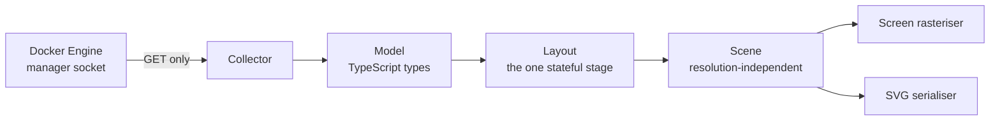

# Architecture decisions

Companion to `SPEC.md`. These are the structural decisions that keep separately built parts of
Portolan consistent. They were taken in a coaching run on 2026-09-11 that was interrupted before
distillation, so `ARCHITECTURE-SPINE.md` was never written and they existed only in that run's process
log until this SPEC was derived. Both gaps that run left — its unratified operational envelope and the verification dimension it never
reached — were closed by the user on 2026-09-14 and are the last two sections of this file.

Each decision names what it binds and what it prevents. A decision without a *prevents* is a
preference, not a decision.

## The pipeline

One direction, adapters at both ends.

**There is no return path anywhere.** No command side, at any stage. This is what makes the read-only
claim structural rather than behavioural.

**One stateful stage: the layout.** Every other stage is a pure function of its input. This is the
answer to *where do I look when the map moves and it should not have.*

**View state and layout state are two separate stores, and view state has no write path to layout.**
Only the three actions named by `SPEC.md` CAP-11 — Reorganise, zone-mode change, node-backdrop toggle —
call the layout. *Prevents:* a filter, a selection, a search or a panel opening moving anything.

## The model

**The model is one TypeScript package, imported by the collector and by the renderer.** One definition
of the graph, on both sides of the three-seam boundary.

The three coupling surfaces permitted by `SPEC.md`'s constraint are the **only** places the renderer may
know a docker-ism: Docker vocabulary on object-naming text, the socket-unreachable screen, and the
engine-too-old message. A fourth would be a defect.

## Object identity

The identity key, not the Docker container ID:

| Object | Key |
| --- | --- |
| Replicated service task | `stack / service / slot` |
| Global service task | `stack / service / node` |
| Volume, network | name |
| Node, service | Docker ID (stable across `stack deploy`) |

*Binds:* position stability, the recognition silhouette, breathing. *Prevents:* a `docker stack deploy`
rebating both positions **and** silhouettes across a whole stack — reintroducing into the product the
exact defect of the founding scenario, *a drawing obsolete at the next `stack deploy`*.

*Verified ground:* in Swarm a task is immutable; a service update destroys and recreates its tasks with
new container IDs, but the slot number survives.

The accepted cost, and the departure from FR-13 it forces, are in `SPEC.md`.

## The collector

**The Docker socket is mounted directly. No proxy sidecar.** Decided by the user against the
assistant's recommendation of a 7-endpoint allow-list proxy. Consequence accepted and named:
privilege minimisation stays a promise kept by the code rather than by an external mechanism.
Benefit: a single container image holds without amendment, and first launch requires no extra piece.

**The Docker adapter is read-only by construction:** the underlying HTTP client refuses any method
other than `GET`. Added *inside* the direct-socket decision without reopening it. It turns *we wrote no
writes* into *we cannot write one*. A whitelisting proxy is documented in the README as **optional**
hardening.

### Engine compatibility

Two engine behaviours bear on what the collector can read, and are the load-bearing content behind
`SPEC.md` CAP-3:

- **Engine 29's nftables backend cannot be enabled in Swarm mode.** One upstream feature has already
  skipped Swarm.
- **moby #51491 (filed 2025-11-12): DNS broken after `swarm init`** on some Engine v29 versions.

Context, not a requirement: SwarmKit is genuinely maintained (latest commit 2026-08-28), and Engine
29.8.0 (2026-09-03) shipped Swarm DNS, overlay and Raft fixes. Classic Swarm ≠ Swarm mode; only
Classic was removed.

## Transport

**SSE, a complete snapshot per survey, no deltas.** *Prevents:* a delta reconciliation protocol paid
for without a measured gain at 400 objects, and the poll-versus-push divergence between two builds.
Staleness derives from the survey timestamp in the payload plus SSE disconnection — which is what makes
the client-side stale state possible.

## Layout

**The server does not hold positions.** Layout runs client-side, in the tab's memory. *Prevents:* the
drift where a build puts layout state on the server and creates a shared map the product never asked
for. The user's words: *two people can have two different views.*

**Layout is deterministic** — same objects in, same positions out. Divergence between two views comes
from an **action**, never from opening the map. *Prevents:* an F5 that re-lays the map, which would be a
fourth undeclared relayout; and a screenshot nobody can reproduce.

**Layout is a pure function of `(model, seed, mode) → positions`:** fixed iteration count, stable
iteration order, no dependency on the clock or on frame timing, and the deformed hull reserved
**before** placement. *Accepted cost:* this forbids every clock- or frame-timing-dependent technique in
the layout.

A layout library is **seed, not spine**: it may be adopted or dropped without the contract changing.

## Rendering

**One scene description, several rasterisers.** The renderer produces a resolution-independent scene —
zones as fields, bodies as path data, marks anchored in screen space, text carrying its own floor. A
screen backend paints it; an SVG serialiser writes it.

*Prevents:* screen and export diverging — the shader the SVG cannot reproduce — and the irreversible
Canvas2D-versus-WebGL bet being taken before any measurement.

*Major side effect:* the landing-frame legibility question becomes measurable **without a browser and
without a GPU**. Stub length, body size and contrast over the worst composited field become assertions
against a generated scene at 396 synthetic objects. That is what CAP-25 is built on.

**The screen backend is deferred** and kept reversible by this decision. See `SPEC.md` → Open Questions.

## The measurement harness

A v1 deliverable, not a convenience tool.

- **Input:** a synthetic cluster at the reference scale — 6 nodes, 14 stacks, 40 services,
  300 containers, 11 overlay networks, 25 volumes, ~2.2 networks per container, 396 objects.
- **Canvas:** 884px, the operative width once the detail-panel column is permanently reserved — **not**
  the 1204px every upstream measurement was computed against.
- **Reports:** distribution of rendered body diameter; mark-rail occupation as a fraction of the body;
  distribution of stub length; contrast of both edge kinds over the worst composited zone field.
- **Fixes no threshold.** The PRD deliberately refuses to invent them and this contract does not either.
  The harness produces evidence; product and design spend it.

## Exposure

**Default: host mode on `127.0.0.1`, plus a `node.role == manager` placement constraint.**

The published stack file is **commented** with the three ways to open it — routing mesh; internal
overlay plus reverse proxy; VPN — directly above the line to uncomment.

*Prevents:* the v1 the brief warned against — an unauthenticated full-topology viewer with one-click
export, reachable from any node.

CAP-21 exists because a safe default with no screen explaining it fails in silence at first contact.

## Operational envelope

Proposed at the architecture checkpoint, ratified by the user on 2026-09-14.

1. **Portolan writes nothing.** No volume, no database, no disk cache. The container is disposable.
2. **The server keeps the last good survey and replays it immediately to a new tab.** With no survey yet
   taken, a new tab waits up to 60s in front of an empty canvas.
3. **A failed survey keeps serving the last good survey with its age**, never nothing. *This is the
   decision that makes the client-side stale state possible:* the map can only pale in place because the
   server never hands it emptiness.
4. **The image is multi-arch, amd64 + arm64.** The homelab tribe is largely on ARM.
5. **Configuration is by environment variable only.** The refresh interval is not among them — it is an
   interface control, not configuration.
6. **The healthcheck tests whether Portolan serves, not whether the survey succeeds.** A survey failure
   is a product state, not a sick container. *Prevents:* Swarm restarting Portolan at every socket
   hiccup, making the map someone is reading disappear — exactly what the stale state exists to avoid.

## Verification and CI

Decided by the user on 2026-09-14, closing the one structural dimension the architecture run left open.

**The harness is a CI gate, not a tool someone remembers to run.**

| Gate | Runs on | Covers |
| --- | --- | --- |
| Lint, typecheck | every PR | — |
| Unit tests | every PR | every stage but the layout, each being a pure function of its input |
| Layout determinism | every PR | same model, seed and mode in → same positions out; the property the whole no-relayout contract rests on |
| Harness assertions | every PR | the four distributions, on a generated 396-object scene |
| Multi-arch build, publish | on tag | amd64 + arm64 |

*Prevents:* the landing-frame legibility question being repaired and then silently re-degraded by a later
PR. Nothing else would catch it — the arithmetic that found it was done by hand, once.

**This gate is possible only because of the scene decision.** The harness needs no browser and no GPU, so
its assertions run in ordinary CI. That is the scene decision's benefit being collected.

**Browser-driven end-to-end tests are out of v1.** They would put a browser and a GPU back into the
verification loop that the scene decision exists to keep out, and the cost would be paid on every PR.

## Localisation

Strings externalised from the first commit, one catalogue per language, **no string literal in any
component**. A new language is a file.
